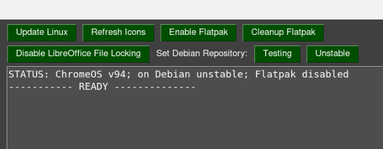

# CROSTINI KDE SETUP #
### Purpose ###
With only two commands, install key apps from KDE, one of the most populur Linux Desktops
due to it efficiency, customizability, and good looks.
For newbies, most importantly, it installs **Discover** which is an elegant, easy-to-use
"app store" for Linux apps and nearly every app is free.

KDE apps work best on Chromebook Linux (a.k.a., Crostini) if certain KDE environment variables are set.
Doing so is a bit tricky and undocumented, and this script automates the basic KDE environment setup.
Once the core KDE apps are installed from the Terminal, use the Chromebook launger to run:
* **Discover** add/launch/remove more Linux applications from a GUI.
* **MaintGUI** which provides a one-button click for the very typical maintenance needs (described below).

For Linux newbies, these scripts help get you started with a minimal of command line interaction;
for Linux experienced (and especially KDE lovers),
this scripts makes painless and certain the install of the KDE core apps (and more).

The setup script additionally installs these core KDE apps that can be launched from you Chromebook launcher:
* **Dolphin** - a file manager including SFTP enabling you to manage the local and remote file systems.
  * Search for "Dolphin" in **Discover** to add plugins that extend its functionality.
  * **Dolphin** can be further extended by installing **K4DirStat**, **KDiff3**, etc., and their service menus from **Discover**.
* **Konsole** - a terminal emulator with profiles to use locally and for SSH session to remote systems
* **Okular** - a document viewer that supports PDFs and many other document formats.
	* Search for "Okular" in **Discover** to find/install its additional backends for markdown, Epub, and others. 
* **Kate** - an text editor with programming support for many languages.

And, it installs:
* **Geany** - an alternative, non-KDE lightweight text editor.
    * Unlike **Kate**, **Geany** can be run with sudo (e.g., to edit system files with a GUI editor)
    * To run a sudo'ed GUI app, like, **Geany**, from Terminal, first run `xhost +` on a separate line.

*Note: this script has been tested on Chromebook v88 through v94.*

---
### "Normal" Installation Instructions ###
Follow only one set of install instructions, either "Normal" (these) or "Starter Image" Installation (in next section).

1. In the Chromebook settings (under Advanced / Developers), enable Linux (the default disk size is OK). See [Set up Linux on Your Chromebook](https://support.google.com/chromebook/answer/9145439?p=chromebook_linuxapps&b=hatch-signed-mp-v6keys&visit_id=637506510150436611-3956044416&rd=1)
1. After enabling Linux, a "Terminal" will open;  then enter these commands (one per line):
	* `git clone https://github.com/joedefen/crostini-kde-setup.git`
	* `bash crostini-kde-setup/kde-setup.sh`
		* *Note: to enter the commands, you may copy each line in Chrome and right-click within the Terminal to paste, saving typing and avoiding typos.*
1. After the script completes (and it will take 10 minutes or so), **restart your container** (i.e., *right-click* the Terminal icon on the shelf and select *Shut down Linux*; then launch *Terminal* again).

---
### "Starter Image" Installation Instructions ###
NOTES:
* this is **requires** an Intel/AMD processor based Chromebook using the x86 instruction set.  This method might be best if minimal install time is crucial or just wishing to trial the system before the "normal" install.ou
* if you did the "Normal" installation, then do NOT do this installation unless you had difficulty and wish to completely replace your current container.
* the user in the container is named "beta" (which affects how you do a few things).
* the restored container size is only 6 GB and you may need to increase that soon depending on your needs.

1. From [tinyurl.com/Crostini-KDE-Setup-Images](https://tinyurl.com/Crostini-KDE-Setup-Images), pick and download one of the backup image files.
	* Note the name includes the Debian Repository and the Chrome OS major version (e.g., "crostini-kde-unstable-v94-2021-12-11.tini" indicate Debian Unstable repository and that the image was built on Chrome OS version 94.
2. Using the procedure in [Back up & restore your Linux files and apps](https://support.google.com/chromebook/answer/9592813?hl=en), "restore" the downloaded backup image file.

---
### Post Install Instructions ###
1. In Terminal, optionally remove the install script by running:
	* `rm -rf ~/crostini-kde-setup`
1. Find your installed Linux apps in the 'Linux app' folder of your Chromebook App Drawer (or type its name, e.g., "Discover", into the Launcher search dialog and hit return when it is first or click its icon).
1. In particular, launch **Discover** to browse for available apps, install apps, launch installed apps, and remove unwanted apps.
1. After every Chromebook update (which occur about monthly), we suggest you launch **MaintGUI** and click **Update Linux** to ensure your container is running the most aggreeable software for your Chromebook).  Do this immediately if you used the "Starter Image" install method.

---
### MaintGUI Instructions ###

Launch **MaintGUI** for most maintenance needs which has these buttons:
* **Update Linux** - updates your Linux and its software which you should run periodically
  and after Chromebook major version updates.
* **Refresh Icons** - repairs icons for linux apps when messed up.
* **Enable Flatpak** - enables **Discover** flatpak app installs from the default flatpak repository
	* NOTE: that snaps do not work so well yet on Crostini and thus not yet enabled with this tool
* **Cleanup Flatpak** - recovers disk space after uninstalling flatpak apps (which Discover does not do automatically)
* **Disable LibreOffice File Locking** - for LibreOffice to work on Google Drive, after installing LibreOffic, run  this to *partly* disable its incompatible file locking. You must also:
    * be on a relatively up-to-date version of LibreOffice (e.g., via change Debian repository to **Unstable**.)
    * in LibreOffice's Tools > Options > LibreOffice > Advanced > Open Expert Configuration, set:
        * *UseLocking* to false
        * *UseDocumentOOoLockFile* to false
* For changing the Debian repository (from initially **Stable**):
    * **Testing** - newer, less stable software; you cannot to return to **Stable**.
    * **Unstable** - newest, least stable software; you may not be able
      to return to **Testing** and cannot return to **Stable**.
#### Which Debian Repository Should You Use?"
Debian is famous for lagging well behind the lastest app releases, but **MaintGUI** can remedy that.  Our advice:
* remain on **Stable** unless you require more current apps although **Unstable** and **Testing** are not nearly as risky as their names suggest.
* you are initially on Debian **Stable** after enabling Linux; if you leave **Stable**,
  you can return only by re-creating Linux or restoring a backup of Linux when on **Stable**.
* before leaving **Stable**, install every app you anticipate needing to minimize the odds of failing to install afterwards.
* before changing repository, backup Linux as a precaution (or accept the possibility you must re-install Linux).
* when changing respository, watch for errors and, and on failure, choose another
  until one succeeds (or restore a known good backup image).
* upgrading to **Unstable** is typically a better choice than **Testing**;  use **Testing** only if
  experimentally, you find it works best for your apps

---
### Additional Notes ###
* **Beware of Linux Issues**.  Linux has bugs, although continually improving and already quite useful.
	* Sometimes the Linux container cannot be restarted; see [Moderators, can we get a pin on Error 51 and other Linux won't start situations?(Reddit)](https://www.reddit.com/r/Crostini/comments/ljdbck/moderators_can_we_get_a_pin_on_error_51_and_other/). So,
		* You may be able to set a flag (chrome://flags/#crostini-reset-lxd-db) to get it working.
		* If not repairable, you may not be able to recover your data.
		* The last resort fix is to remove Linux and (1) then renable it and do the setup or (2) restore from backup [Restore your Linux files](https://support.google.com/chromebook/answer/9592813?hl=en)
	* Protect yourself by doing regular backups (to an SD card if short on internal disk space) if you store anything of importance or difficult to re-create within your container.  It is best practice to store documents in your Chromebook's "My Files" (or even better, "Google Drive", not in your containter home directory.  But, if backup is prudent, see [Back up & restore your Linux files and apps](https://support.google.com/chromebook/answer/9592813?hl=en)
* **You can vary UI settings.** The script establishes the Breeze Icon Theme.  After setup, from **Terminal** you can run `qt5ct` to vary some user interface settings.
* **Change Terminal Settings.** If you wish to customize the terminal (e.g., change colors), then type CTRL-SHIFT-P in the Terminal window to get the Settings popup window.
* **Make your non-Linux files available to Linux.** Open the Chromebook Files app and right click on "My Files", "Google Drive", and "SD Card" (if installed) and select "Share with Linux" to make each visible to Linux. Then, within the Linux file manager,add these "Place" shortcuts for your shared locations:
	* **My Files** at `/mnt/chromeos/MyFiles`
	* **Google Drive** at `/mnt/chromeos/GoogleDrive/MyDrive`
	* **SD Card** at `/mnt/chromeos/removable/SD Card/`
* **Not every Linux app runs well.** You will find many Linux apps that **Discover** lists work fine, but certainly not all.
	* Sometimes the application will have settings that make it more useful (trying googling a solution).
	* If an application text and icons are too small, then launch it from the App Drawer (not Discover), right click on its icon in the Chromebook Shelf, select "Use Low Density", close the app, and restart the app.  If the appearance not more acceptable, revert the density choice.
	* You might find [KDE Apps](https://apps.kde.org/) the most aggreeable, but not all of them work well either.
	* Many popluar non-KDE apps work well, including **GIMP**, **Firefox**, **VLC**, **Thunderbird**, **Aisleriot Solitaire**, and **GNU Backgammon**.
