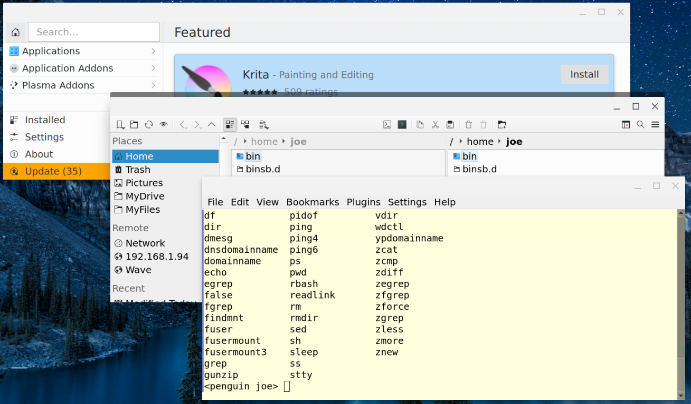

# CROSTINI KDE SETUP #
> * See this and similar projects at [Chrome Appliances](https://www.chromeappliances.com/)
> * Having trouble?  See "Known Issues" below.
>
>    *   **ALERT**: "Debian Testing" and "Debian Unstable" are unsupported options owing to gross  Debian 12 (a.k.a., Bookworm) incompatibilities (starting about Apr 2023).

### Purpose ###
With only two commands, install key apps from KDE, one of the most popular Linux Desktops due to it efficiency, customizability, and good looks (but **it does NOT install the KDE Plasma Desktop**). For newbies, most importantly, it installs **Discover** which is an elegant, easy-to-use "app store" for Linux apps and nearly every app is free. 

KDE apps work best on Chromebook Linux (a.k.a., Crostini) if certain KDE environment variables are set. Doing so is a bit tricky and undocumented, and this script automates the basic KDE environment setup. Once the core KDE apps are installed from the Terminal, use the Chromebook launcher to run:

* **Discover** add/launch/remove more Linux applications from a GUI.
* **MaintMenu** which provides a one-key press for the very typical maintenance needs (described below).

For Linux newbies, these scripts help get you started with a minimal of command line interaction; for Linux experienced (and especially KDE lovers), this scripts makes painless and certain the install of the KDE core apps (and more).

**Notes/Limitations:**

* To run very well, we recommend a mid-range Chromebook (i.e., a *minimum* of Intel i3 CPU, 8GB memory, 64 GB disk) for any Linux environment, and this project does not substantially raise (or lower) the recommended specs.
* Always temper expectations ... Crostini is design to run productivity apps (especially developer tools), not resource intensive games.
* On low-end Chromebooks, temper expectations much more.



The setup script additionally installs these core KDE apps that can be launched from you Chromebook launcher:

* **Dolphin** - a file manager including SFTP enabling you to manage the local and remote file systems.
  * Search for "Dolphin" in **Discover** to add plugins that extend its functionality.
  * **Dolphin** can be further extended by installing **K4DirStat**, **KDiff3**, etc., and their service menus from **Discover**.
* **Konsole** - a terminal emulator with profiles to use locally and for SSH session to remote systems
* **Okular** - a document viewer that supports PDFs and many other document formats.
	* Search for "Okular" in **Discover** to find/install its additional backends for markdown, Epub, and others. 
* **Kate** - an text editor with programming support for many languages.

And, it installs:
* **Geany** - an alternative, non-KDE lightweight text editor.
    * Unlike **Kate**, **Geany** can be run with sudo (e.g., to edit system files with a GUI editor instead of clumsy, crude `nano`)
    * To run a sudo'ed GUI app, like, **Geany**, from Terminal, first run `xhost +` on a separate line.

Also, the setup script sets the 'root' and user password to `pw` so that it is known if needed of recovery (e.g., to fix a mangled sudoers config).

Again, **the KDE Plasma Desktop is not installed and cannot be installed satisfactorily** even though Discover offers the Desktop for installation.  So, you must mostly stick to installing "Applications", per se, in Discover, not the Plasma Desktop or its Addons.

---
### Known Issues (Based on Tests thru ChromeOS v114) ###

>* **v100: broke [PySimpleGUI](https://pypi.org/project/PySimpleGUI/) and thus `MaintGUI`.**
>	* **Fix:** See the section, "Updating `crostini-kde-setup` Itself" near the end to upgrade to `MaintMenu`.
>		* `MaintMenu` replaced ~~`MaintGUI`~~ and is based on [Simple Terminal Menu](https://pypi.org/project/simple-term-menu/) which is comparably unbreakable and has other advantages.
>* **v102: going directly to Unstable from Stable may cause start-up failure.**
>	* **Workaround:** first, go to **Testing** and then **Unstable** (imaginably, this may happen in any ChromeOS version).
>* **v112 (Apr 2023): Debian 12 (Bookworm) breaks compatibility of "Debian Unstable" and "Debian Testing"** with Crostini (e.g., breaking sudoers config, python package installs, all graphical/X11 apps, etc.).
>
>	* **Workaround**. (1) re-create containers on Testing/Unstable. (2) Remain on Debian Stable.  

---
### Installation Instructions ###

>In the last section of this README, there are alternative install instructions.

1. In the Chromebook settings (under Advanced / Developers), enable Linux (the default disk size is OK). See [Set up Linux on Your Chromebook](https://support.google.com/chromebook/answer/9145439?p=chromebook_linuxapps&b=hatch-signed-mp-v6keys&visit_id=637506510150436611-3956044416&rd=1). After enabling Linux, a Terminal will open.
3. Then enter these commands (one per line):
	* `git clone https://github.com/joedefen/crostini-kde-setup.git`
	* `bash crostini-kde-setup/kde-setup.sh`
		* *Note: to enter the commands, you may copy each line in Chrome and right-click
		within the Terminal to paste, saving typing and avoiding typos.*
1. After the script completes (and it will take 10 minutes or so), **restart your container** (i.e., *right-click* the Terminal icon on the shelf and select *Shut down Linux*; then launch *Terminal* again).

---
### Post Install Instructions ###
1. In Terminal, optionally remove the install script by:
	* `rm -rf ~/crostini-kde-setup`
1. Find your installed Linux apps in the 'Linux app' folder of your Chromebook App Drawer (or type its name, e.g., "Discover", into the Launcher search dialog and hit return when it is first or click its icon).
1. In particular, launch **Discover** to browse for available apps, install apps, launch installed apps, and remove unwanted apps.
1. After every Chromebook update (which occur about monthly), we suggest you launch **MaintMenu** and choose **Update Linux** to ensure your container is running the most aggreeable software for your Chromebook).  Do this immediately if you used the "Starter Image" install method.
	* If **MaintMenu** will not start, then in Terminal, run `maintmenu`; if not working, it may suggest what remains broken.
---
### MaintMenu Instructions ###
Launch **MaintMenu** for most maintenance needs. From the Chromebook Launcher, it opens `konsole` in full screen.  Ideally, you remain in full screen until done, but to multi-task, you may:

* Press the "Toggle Fullscreen" button (above the "5" key).
* Press the "Overview" key (above the "6" key).

`MaintMenu` offers a "smart" subset of these menu options presenting only those that are sensible to use:
```
=== MaintMenu: ChromeOS=v114 DebRelease=stable Flatpak=on  ===

  q: Quit
  A: Set root password [suggested: "pw"]
  B: Set current user password [suggested: "pw"]
  u: Update Linux -- run after ChromeOS update (at least)
  r: Refresh Icons -- fix cases of icons becoming lost
  f: Enable Flatpak -- w Discover support (more steps in README)
  c: Cleanup Flatpak -- clean disk after uninstalling FlatPak apps
  p: Purge Flatpak -- remove FlatPak apps and disable its support
  t: Debian Testing -- [UNSUPPORTED] switch to Testing release
  s: Debian Unstable -- [UNSUPPORTED] switch to Unstable release (a.k.a., Sid)
:::::: Highlight w Up/Down/key and Enter
```
So, you will have have some choices:

* **Quit** - *use this option* to exit MaintMenu which is available only when idle between operations; do **NOT** use other methods to close.

    * *After an operation, it is best to keep MaintMenu open in case of problems. Then, you can peruse the output, and read/copy/paste as needed for troubleshooting.*

* **Set root password** -  *Always know your root (and user) password* ensure you can perform maintenance if an upgrade or pilot error mangles the "sudoers" config.

    * **Note:**: the install script sets/resets the root and user passwords to "pw". Be sure to remember altered passwords.
    
* **Set current user password** - Similarly, know your user password (which may be the same as your root password in case of mangled "sudoers" config).
* **Update Linux** - updates your Linux and its software which you should run periodically
  and after Chromebook major version updates.
* **Refresh Icons** - *sometimes* repairs icons for linux apps when messed up *after* having been more correct than currently.  This will not fix icons for newly install programs being wrong, generally. After running this, all or most of the Linux icons will disappear, and slowly be restored when ChromeOS polls for installed Linux programs/icons.  Sometimes, ChromeOS will show a penguin as the icon for a program and then later repair it, and sometimes it is permanent because the icon is not present or has an unsupported format.
* **Enable Flatpak** - enables **Discover** flatpak app installs from the default flatpak repository.  **After enabling Flatpak, some apps may require these additional steps**:
    * Press Ctrl+Alt+T (when hovering over a Chrome window). A "crosh" terminal window will open (this is NOT the crostini terminal).
    * Type `vsh termina` and press enter.
    * Type `lxc config set penguin security.nesting true` and press enter.
    * Twice type `exit` and press enter (to exit termina and crosh).
    * Restart crostini (i.e., right-click on Terminal in the shelf, and click "Shut down Linux").
* **Cleanup Flatpak** - recovers disk space after uninstalling flatpak apps (which Discover does not do automatically)
* **Purge Flatpak** - removes **ALL** install flatpak apps, the flatpak core tools, and **Discover's** awareness of flatpak; i.e., you cannot install flatpaks until re-enabled.
* **Currently Unsupported**: ~~For changing the Debian repository  from its initial **Stable** (and see **Which Debian Repository Should You Use** before doing so), select:~~
    * ~~**Debian Testing** - newer, less stable software; you cannot to return to **Stable**.~~
    * ~~**Debian Unstable** - newest, least stable software; you may not be able to return to **Testing** and cannot return to **Stable**.~~
 
**NOTE**: **Snaps do not work well** (e.g., see [Yes, you can install Snap packages on Chrome OS, but it’s not great](https://chromeunboxed.com/install-snap-packages-chromebook-crostini-linux-how-to/)), and thus no Snap buttons are provided lest it leads you down that rathole.

---

### ~~Which Debian Repository Should You Use?~~ ###

> **As of Apr 2023 until further notice, remain on Debian Stable** unless you wish to experiment on how to make Debian 12+ compatible with the current Crostini (based on Debian 11). *So, at least temporarily, ignore most of this section*.

Debian is famous for lagging well behind the latest app releases, but **MaintMenu** can remedy that.  Our advice:
* remain on **Stable** unless you require more current apps although **Unstable** and **Testing** are not nearly as risky as their names suggest.
* you are initially on Debian **Stable** after enabling Linux; if you leave **Stable**,
  you can return only by re-creating Linux or restoring a backup of Linux when on **Stable**.
* before leaving **Stable**, install every app you anticipate needing to minimize the odds of failing to install afterwards.
* before changing repository, backup Linux as a precaution (or accept the possibility you must re-install Linux).
* when changing repository, watch for errors and, and on failure, choose another
  until one succeeds (or restore a known good backup image).
* upgrading to **Testing** is typically a better choice than **Unstable**;  use **Unstable** only if
  experimentally, you find it works best for your apps. **Notes**:

  * when you leave **Stable** for **Unstable** and **Testing**, `contrib` is added to the sources which adds certain apps like `tor`.

The built-in rules for manipulating Debian sources are very simplistic.  You can manually update the sources per:
* [Debian SourcesList](https://wiki.debian.org/SourcesList)
* [Apt Configuration](https://wiki.debian.org/AptConfiguration?action=show&redirect=AptPreferences)

*If you decide to "roll your own" sources, you should **Update Linux** afterwards, and, henceforth always manually update the sources.*

---
### Additional General Notes about Crostini
* **Beware of Linux Issues**.  Linux has bugs, although continually improving and already quite useful.
	* **Sometimes the Linux container cannot be restarted**; see [Moderators, can we get a pin on Error 51 and other Linux won't start situations?(Reddit)](https://www.reddit.com/r/Crostini/comments/ljdbck/moderators_can_we_get_a_pin_on_error_51_and_other/). So,
		* You may be able to set a flag (chrome://flags/#crostini-reset-lxd-db) to get it working.
		* If not repairable, you may not be able to recover your data.
		* The last resort fix is to remove Linux and (1) then renable it and do the setup or (2) restore from backup [Restore your Linux files](https://support.google.com/chromebook/answer/9592813?hl=en)
	* **Protect yourself by doing regular backups** (to an SD card if short on internal disk space) if you store anything of importance or difficult to re-create within your container.  It is best practice to store documents in your Chromebook's "My Files" (or even better, "Google Drive", not in your containter home directory.  But, if backup is prudent, see [Back up & restore your Linux files and apps](https://support.google.com/chromebook/answer/9592813?hl=en)
* **You can vary UI settings.** The script establishes the Breeze Icon Theme.  After setup, from **Terminal** you can run `qt5ct` to vary some user interface settings.
* **Change Terminal Settings.** If you wish to customize the terminal (e.g., change colors), then type CTRL-SHIFT-P in the Terminal window to get the Settings popup window.
* **Make your non-Linux files available to Linux.** Open the Chromebook Files app and right-click on "My Files", "Google Drive", and "SD Card" (if installed) and select "Share with Linux" to make each visible to Linux. Then, within the Linux file manager, add these "Place" shortcuts for your shared locations:

	* **My Files** at `/mnt/chromeos/MyFiles`
	* **Google Drive** at `/mnt/chromeos/GoogleDrive/MyDrive`
	* **SD Card** at `/mnt/chromeos/removable/SD Card/`
 
* **Not every Linux app runs well.** You will find many Linux apps that **Discover** lists work fine, but certainly not all.

	* **Sometimes newly install apps won't start** (and the more demanding the app, the more likely).  Restart your container before throwing in the towel.
	* **Sometimes the application will have settings that make it run better.** (trying googling a solution).
	* **If an application text and icons are too small, then** launch it from the App Drawer (not Discover), right-click on its icon in the Chromebook Shelf, select "Use Low Density", close the app, and restart the app.  If the appearance not more acceptable, revert the density choice.
	* **You often find [KDE Apps](https://apps.kde.org/) are the most aggreeable**, but not all of them work well either.
	* Many popluar non-KDE apps work well (with enough memory), including:
		* **GIMP** - compares to Photoshop, but I suggest using **Krita** (which is actually better rated and a KDE app).
		* **Firefox** - but I **strongly** suggest using Chromebook's native Chrome which is better integrated and avoids another memory pig.
		*  **VLC** and **MPV** - both are good media players; VLC has more knobs, but MPV suffices for most needs.
		*  **Thunderbird** - if you must, but Chromebook's native Gmail is a great alternative for most of us and avoids another memory pig.
		*  **Aisleriot Solitaire** - has scores of high quality games including Freecell (and my "must have" time killing app).
		*  **GNU Backgammon** - a great Backgammon implementation whose GUI is not quite right on Crostini (but sufferable with adjusted settings).

* Find additional useful Crostini tips at [mikeroyal/Chrome-OS-Guide](https://github.com/mikeroyal/Chrome-OS-Guide)

---

---

## MAINTENANCE AND TROUBLESHOOTING INFORMATION
---
### Updating `costini-kde-setup` Itself
When you wish/need to update this software, then choose from:

* Method 1 (always should work)
	1. In Terminal, remove the install script by:
		* `rm -rf ~/crostini-kde-setup`
	1. Follow the "Normal" Install instructions (except you don't re-create the container).
* Method 2 (if the install directory exists)
	1. In Terminal, update the cloned repo
		* `cd ~/crostini-kde-setup`
		* `git pull`
	2. Re-run the setup with:
		* `bash kde-setup.sh`

---

### Directly Running MaintMenu (a.k.a., `maintmenu`)
At any Terminal prompt, you may run `maintmenu` for a similar experience as running `MaintMenu` via the launcher.

---

### Directly Running `maintcli`
Except for the user interface, you may perform the same tasks with `maintcli` which must be given a "subcommand" as an argument.
```
	USE: maintcli {subcmd} # where {subcmd} may be:
		  set-password-root, set-password-user,
		  get-state, update-linux, refresh-icons,
		  enable-flatpak, purge-flatpak, cleanup-flatpak,
		  set-debian-testing, set-debian-unstable,
		  or disable-libreoffice-file-locking
```
For example, run `maintcli update-linux` to update the Linux software in your container.

---

### "Starter Image" Installation Instructions

#### Notes for "Starter Image" Install
	
* this install method **requires** an Intel/AMD processor Chromebook using the x86 instruction set.  This method can minimize install time/efforts for trials, etc.
* if you did the "Normal" installation, then do NOT do this installation unless you had difficulty and wish to completely replace your current container.
* the "user" in the container is named "beta" (which affects how you do a few things).
* the restored container size is defaulted and you may need to increase that soon depending on your needs.

#### "Easy" Steps for "Starter Image" Install
1. From Releases on this page, pick and download a binary backup image file and install on your Chromebook's storage.
1. Follow the restore instructions in [Back up & restore your Linux files and apps](https://support.google.com/chromebook/answer/9592813?hl=en).

#### "Extreme" Steps for "Starter Image" Install
Although in recent versions of ChromeOS, the standard restore instructions seem to work more often.  But, if a standard restore fails, this procedure may reset your Chromebook's state to permit a successful restore.
1. Follow the **"Turn off Linux"** instructions in [Set up Linux on your Chromebook](https://support.google.com/chromebook/answer/9145439?hl=en).
1. Enter "Crosh" (type CTRL-ALT-T), and run `vmc destroy termina`.
1. Enter "chrome://flags" into Chrome's Omnibar, search for "crostini", and ensure all settings are "Default".
1. Power down your Chromebook and restart it.
1. From Releases on this page, pick and download a binary backup image files.
1. Right-click the downloaded file and select, "Replace your Linux files and apps with a previous backup."

